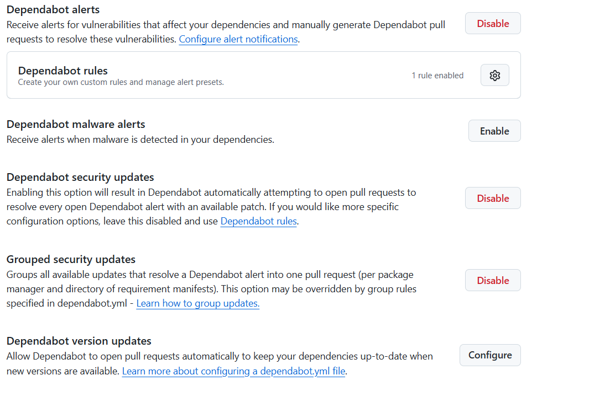
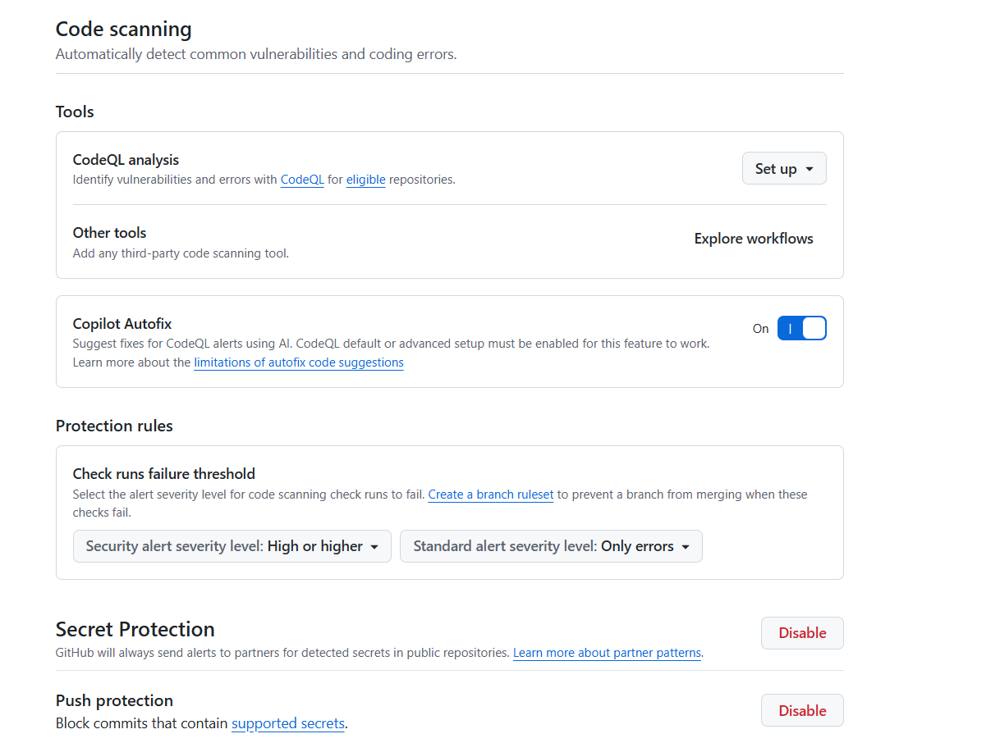

# Sécurité — Task Manager Lite

## Dependabot et Secret Scanning

Les options suivantes sont activées sur le repo GitHub :
- ✅ Dependabot alerts
- ✅ Dependabot security updates
- ✅ Secret scanning (Push protection)

